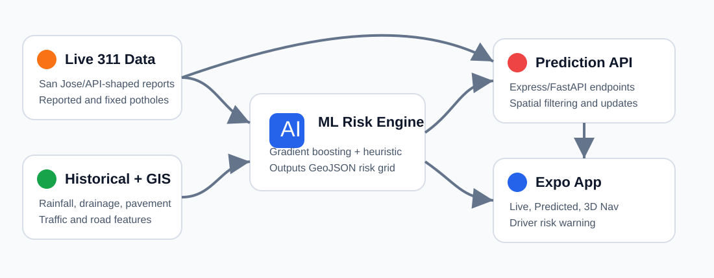
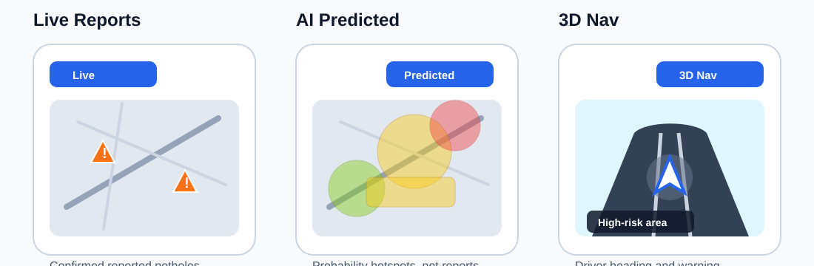
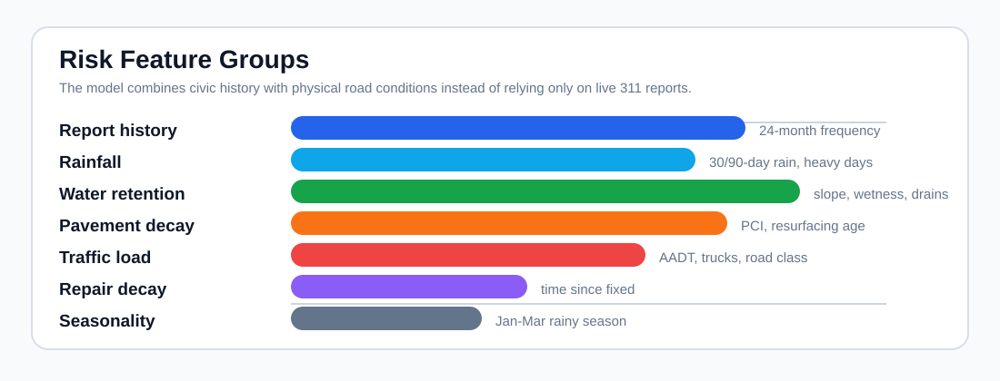
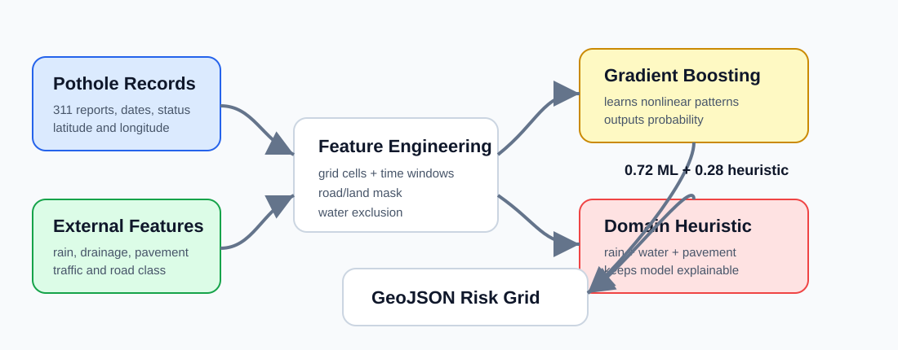
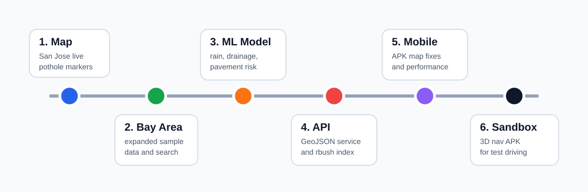

# Bay Area Pothole AI Tracker: Project Case Study

## Project Summary

The Bay Area Pothole AI Tracker is a React Native and Expo application that shows live pothole reports, predicts pothole-prone areas, and gives drivers a warning when they enter a high-risk neighborhood. The project started as a simple San Jose pothole map and evolved into a Bay Area machine learning system with a mobile app, prediction API, training script, hosted-service plan, and sandbox navigation build.

This case study explains what was built, how the system works, what failed during development, and how the project improved through human direction and OpenAI Codex implementation support.



## Why This Project Was Built

The goal was not just to display potholes that had already been reported. The project was built to answer a more useful question:

**Can we combine live 311 reports, historical pothole records, rainfall, drainage, pavement condition, and traffic data to estimate where potholes are likely to occur next?**

This matters because potholes are strongly connected to real-world conditions. Water can collect on poor pavement, weaken the road surface, and loosen gravel and asphalt. Heavy traffic and truck routes add stress. A live 311 feed tells us what has already been reported, but a prediction layer can warn drivers and help identify vulnerable road areas earlier.

## What We Built

The final project includes:

- A React Native Expo mobile app.
- A web-compatible map preview.
- A GitHub Pages hosted web deployment workflow.
- Live pothole markers from mock/API-shaped 311 data.
- Bay Area historical pothole sample data.
- Environmental predictor data for rainfall, drainage, pavement, and traffic conditions.
- A Python machine learning training script.
- A Node.js Express prediction microservice.
- A Hugging Face/FastAPI deployment path for the prediction API.
- A map-based probability hotspot layer.
- A live driver warning when the user enters a high-risk area.
- A separate 3D sandbox navigation APK for testing movement without physically driving.

## App Views

The app was designed around three main views:



**Live View**

The Live tab shows reported potholes as orange warning markers. This view represents observed civic data, such as San Jose 311-style reports or mock data shaped like a 311 API response.

**Predicted View**

The Predicted tab shows AI-generated probability hotspots. These are not confirmed potholes. They are grid cells where the model estimates a higher chance of pothole activity based on historical and environmental conditions.

**3D Nav View**

The 3D Nav tab provides a simplified navigation-style view with the driver's live position and heading. It is intended to make the warning experience feel closer to a real driving scenario while keeping the app simple.

## Data Used

The project uses two categories of data:

1. **Live or current pothole data**
   - San Jose 311 API-style records.
   - Mock Bay Area pothole records for development when API keys or live endpoints are unavailable.

2. **Historical and predictive data**
   - Historical pothole report records.
   - Rainfall indicators.
   - Drainage and water-retention predictors.
   - Pavement condition and resurfacing age.
   - Traffic and truck exposure.
   - Road class information.



The live 311 data is used to show what has already been reported. The historical and environmental data is used to train the predictive model.

## Machine Learning Approach

The current model is a pothole risk classification system. It divides the Bay Area into grid cells and estimates the probability that each cell is likely to experience pothole activity.

The Python training script performs the following steps:

1. Reads historical pothole CSV data.
2. Detects common column names for latitude, longitude, request date, status, and fixed date.
3. Groups pothole records into spatial grid cells.
4. Joins each grid cell with nearby environmental predictor samples.
5. Builds features such as recent report count, rainy-season weight, repair decay, rainfall, drainage, pavement condition, and traffic exposure.
6. Trains a `HistGradientBoostingClassifier`.
7. Blends the model prediction with a domain-informed heuristic score.
8. Writes the result as GeoJSON for the frontend map.



### Why Gradient Boosting Was Used

Gradient boosting was selected because pothole risk is not likely to be a simple straight-line relationship. For example, rainfall alone may not cause potholes, but rainfall combined with poor pavement, flat roads, weak drainage, and heavy vehicle traffic can produce higher risk. A tree-based boosting model can learn these kinds of nonlinear interactions better than a simple linear model.

The project also includes a weighted heuristic fallback. This makes the system more explainable and keeps the prediction layer usable even when there is not enough data for a reliable trained model.

## Model Evaluation

A GitHub-rendered evaluation notebook is included at [docs/model_evaluation.ipynb](docs/model_evaluation.ipynb). It uses the bundled sample data to compare baseline models and generate visual outputs.

Current sample evaluation artifacts:

- [Model metrics CSV](docs/model_metrics.csv)
- [Model comparison chart](docs/figures/model-comparison.svg)
- [ROC curve](docs/figures/roc-curve.svg)
- [Confusion matrix](docs/figures/confusion-matrix.svg)
- [Feature importance chart](docs/figures/feature-importance.svg)
- [Risk grid distribution](docs/figures/risk-distribution.svg)
- [Live vs predicted comparison](docs/figures/live-vs-predicted.svg)

These results are useful for explaining the pipeline, but they should be treated as sample-data validation. A final academic or production study should rerun the notebook with larger official historical datasets and a time-based validation split.

## Prediction API

The prediction service is separate from the app. This was an important design choice because machine learning and map rendering should not be tightly coupled.

The Node.js Express service:

- Loads the generated GeoJSON risk grid.
- Uses spatial indexing with `rbush`.
- Accepts viewport bounding boxes.
- Returns only relevant prediction cells.
- Applies gradient weighting so neighboring high-risk cells form smoother hotspot areas.
- Supports partial risk updates when a user reports a new pothole.

Important endpoints:

```text
GET  /api/v1/predictive-map
GET  /api/v1/model-metadata
POST /api/v1/report
```

A FastAPI version was also prepared for Hugging Face Spaces so the prediction API can be hosted later.

## Frontend and Mobile App

The frontend was built with React Native and Expo. The app supports Android APK builds through EAS.

Important frontend features:

- Full-screen map interface.
- Search for Bay Area cities and neighborhoods.
- Live vs Predicted vs 3D Nav mode switch.
- Pothole status filters.
- Report button for user-submitted potholes.
- Live location tracking.
- Temporary warning banner for high-risk areas.
- OpenStreetMap tile fallback for native builds.
- Pinch zoom support.
- Optimized hotspot rendering to reduce map lag.

## Development Timeline

The project went through several iterations. Each version exposed a different issue that had to be fixed.



### Major Iterations

**1. Basic San Jose map**

The first version showed pothole markers around San Jose. It proved the map UI concept, but it was too limited geographically.

**2. Bay Area data expansion**

The dataset was expanded to include broader Bay Area examples. This made the project more useful but also introduced map performance and prediction-quality issues.

**3. Predictive model**

The Python model was added to generate probability cells. At first, some predictions appeared in the bay water, which made it clear that a land/road mask was needed.

**4. Prediction service**

The Node.js service was added to serve the risk grid to the app instead of loading everything directly into the frontend.

**5. Mobile app debugging**

Android builds initially had map rendering problems. The app was adjusted to support OpenStreetMap tiles in native builds and Google Maps where configured.

**6. 3D navigation and sandbox build**

The app gained a 3D navigation tab and a separate sandbox APK for testing movement and high-risk warnings without physically driving.

## Human Role vs Codex Role

This project was collaborative. OpenAI Codex helped implement and debug the software, but human input was necessary for the project direction, domain reasoning, design judgment, and validation.

### Human Contributions

The human role was necessary for:

- Choosing the real-world problem: pothole tracking and prediction.
- Explaining why rainfall and standing water should be considered predictors.
- Identifying that prediction cells in the bay water were unrealistic.
- Testing the APK on a phone/emulator.
- Judging whether the UI looked usable or confusing.
- Deciding that the app should stay simple for drivers.
- Requesting separate actual and sandbox app versions.
- Providing API/build credentials and approving build/deployment steps.
- Comparing screenshots and pointing out visual problems.
- Defining the report direction and portfolio goals.

### OpenAI Codex Contributions

Codex helped with:

- Building the Expo React Native app structure.
- Creating map components, filters, search, and report UI.
- Implementing mock 311 data and API-shaped services.
- Writing the Python pothole risk training script.
- Adding environmental predictors and feature engineering.
- Creating the Node.js prediction microservice.
- Adding spatial indexing and viewport filtering.
- Creating the probability hotspot layer.
- Fixing map rendering and mobile layout issues.
- Adding 3D Nav and sandbox navigation behavior.
- Running EAS builds and producing APK links.
- Writing documentation and organizing project files.

The strongest part of the collaboration was the feedback loop. Human testing revealed practical issues, and Codex translated those observations into code changes.

## Problems Faced and Fixes

| Problem | What Happened | Fix |
|---|---|---|
| Map did not render correctly on mobile | Google branding appeared but tiles were blank | Added native OpenStreetMap tile fallback and configuration guidance |
| Prediction cells appeared in bay water | The model grid covered the full Bay Area bounding box | Added approximate water exclusion polygons and a road/land prediction mask |
| Prediction overlay caused lag | Too many cells were rendered while panning | Added viewport filtering, cell limits, and spatial indexing |
| Predicted tab initially showed no heatmap | App and service were not aligned on prediction data | Connected the frontend to the predictive endpoint and added fallback data behavior |
| 3D Nav view looked incomplete | Road and arrow layout did not fill the screen properly | Refined the 3D scene layout, arrow placement, and pinch zoom behavior |
| Actual app and sandbox app were confused | Both were being discussed as if they were the same build | Added a separate sandbox package and build flag |
| Report was too generic and too long | The first report followed a broad ML-dashboard prompt | Replaced it with this project-specific case study |

## Current Status

The project currently has:

- A working actual Android app build.
- A separate sandbox Android app build.
- Live pothole marker display.
- Predicted hotspot display.
- 3D navigation mode.
- Python training script.
- Node.js prediction service.
- Hugging Face deployment folder.
- GitHub-ready documentation.

Supporting documentation:

- [API reference](docs/API.md)
- [Web deployment guide](docs/DEPLOYMENT.md)
- [Testing checklist](docs/TESTING.md)
- [Screenshot guide](docs/screenshots/README.md)
- [Data source notes](data/DATA_SOURCES.md)

## Limitations

The project is not a production transportation system yet. Current limitations include:

- Sample datasets are small.
- Environmental predictors are shaped like production inputs but should be replaced with authoritative data.
- The water/road mask is approximate and should eventually use official GIS layers.
- The model still needs formal validation against future reports.
- User reports are locally updated or service-updated, but should be persisted in Firestore or another database.
- Hosted prediction services may sleep on free tiers.
- The app does not yet provide full route optimization around pothole risk.

## Future Improvements

Useful next steps include:

- Add a formal evaluation notebook with ROC-AUC, confusion matrix, precision, recall, and feature importance.
- Add SHAP explanations for model interpretability.
- Replace sample environmental data with official rainfall, pavement, traffic, drainage, and road GIS sources.
- Add Firestore for real-time shared user reports.
- Add a route-based warning system.
- Add admin dashboard analytics for city maintenance teams.
- Deploy the prediction API permanently.
- Add iOS build support.

## Key Takeaway

This project shows how a simple map app can grow into a full-stack machine learning system. The most important lesson was that the model alone is not the product. The product needs data, prediction logic, map performance, mobile testing, deployment, and a user interface that drivers can understand quickly.

The final result is a practical prototype: live pothole reports show what is already known, and AI-predicted hotspots show where risk may be higher based on historical and environmental conditions.
